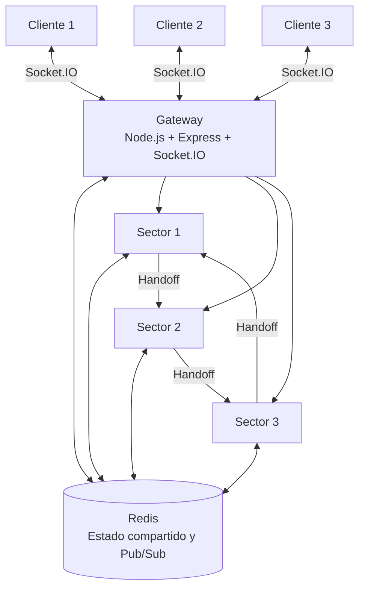
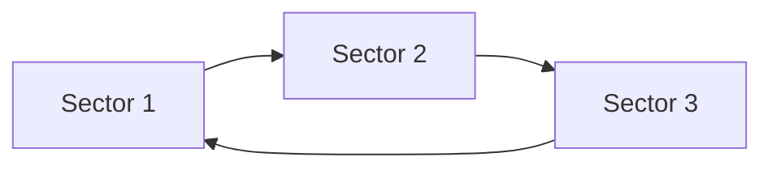

# RaceSync F1

RaceSync F1 es un sistema distribuido multijugador inspirado en una carrera de Fórmula 1. El proyecto fue desarrollado como parte de un proyecto integrador académico de la Carrera de Software de la Pontificia Universidad Católica del Ecuador - Sede Manabí.

El sistema permite la interacción de varios jugadores en tiempo real y distribuye el procesamiento de la carrera entre tres nodos de sector. La comunicación, sincronización y coordinación del estado se apoyan en un Gateway central de acceso, Redis como mecanismo de estado compartido y publicación de eventos, Socket.IO para comunicación en tiempo real, heartbeats para monitoreo de nodos y el algoritmo Bully para elección de líder.

## Descripción general

RaceSync F1 está compuesto por los siguientes elementos principales:

- Cliente web para la interacción con el juego.
- Gateway encargado de las conexiones de los jugadores y la comunicación en tiempo real.
- Redis para almacenamiento temporal de estado y mensajería Pub/Sub.
- Tres nodos de sector que procesan diferentes rangos de la pista.
- Mecanismo de handoff para transferir vehículos entre sectores.
- Reloj vectorial para representar el orden lógico de eventos.
- Heartbeats para monitorear la disponibilidad de los nodos.
- Algoritmo Bully para elección de líder.
- Pruebas automatizadas con Selenium.
- Análisis de calidad mediante SonarQube.
- Pipeline de integración continua ejecutado con Jenkins.

## Objetivo

Desarrollar un sistema distribuido interactivo que permita aplicar y demostrar conceptos de comunicación en tiempo real, concurrencia, sincronización lógica, coordinación entre nodos, tolerancia a fallos, elección de líder, pruebas automatizadas e integración continua.

## Arquitectura



### Flujo principal

1. El usuario accede al juego desde el navegador.
2. El cliente se conecta al Gateway mediante Socket.IO.
3. El Gateway registra al jugador y lo incorpora inicialmente al Sector 1.
4. Cada nodo de sector procesa los vehículos que se encuentran dentro de su rango.
5. Redis mantiene información compartida y distribuye eventos entre los componentes.
6. Cuando un vehículo alcanza el límite de un sector, se realiza un handoff hacia el siguiente nodo.
7. El Gateway recibe los estados y eventos y los transmite a los clientes conectados.

## Componentes

### Gateway

Ubicación:

```text
gateway/
```

El Gateway constituye el punto de entrada al sistema y tiene entre sus responsabilidades:

- servir la interfaz web;
- administrar conexiones Socket.IO;
- registrar jugadores;
- recibir comandos de conducción;
- comunicarse con los nodos de sector;
- publicar y consumir eventos mediante Redis;
- mantener el estado de jugadores conectados;
- gestionar el reloj vectorial;
- notificar cambios de sector;
- exponer un endpoint de salud.

Puerto local:

```text
3000
```

Endpoint de verificación:

```text
GET /health
```

### Nodos de sector

Ubicación:

```text
sector-node/
```

El mismo código base se utiliza para ejecutar tres nodos independientes:

```text
Sector 1 -> puerto 3001
Sector 2 -> puerto 3002
Sector 3 -> puerto 3003
```

Responsabilidades:

- administrar vehículos dentro del sector;
- actualizar posición, velocidad y carril;
- detectar colisiones;
- publicar el estado del sector;
- recibir y transferir vehículos;
- generar heartbeats;
- detectar fallos;
- participar en la elección de líder.

### Redis

Redis se utiliza como mecanismo de estado compartido y mensajería entre los componentes.

Entre los datos y eventos manejados se encuentran:

- información de vehículos;
- posición;
- velocidad;
- sector actual;
- estado de la carrera;
- eventos de jugadores;
- eventos de colisión;
- heartbeats de los sectores;
- eventos relacionados con fallos y elección de líder.

## Distribución de la pista

La pista se divide conceptualmente en tres rangos:

```text
Sector 1 -> 0 a 33
Sector 2 -> 33 a 66
Sector 3 -> 66 a 100
```

Cuando un vehículo supera el límite de un sector, el nodo realiza un handoff hacia el siguiente.



## Sincronización lógica

El Gateway utiliza un reloj vectorial para representar el orden lógico de eventos dentro del sistema distribuido.

El reloj se actualiza durante operaciones relevantes como:

- registro de jugadores;
- publicación de eventos;
- recepción de estados;
- comandos enviados por los clientes.

El valor del reloj vectorial puede observarse tanto en el estado del Gateway como en la interfaz del juego.

## Heartbeats y tolerancia a fallos

Los nodos de sector publican periódicamente claves de heartbeat en Redis:

```text
hb:sector:1
hb:sector:2
hb:sector:3
```

Este mecanismo permite monitorear la disponibilidad de los nodos y detectar cuando alguno deja de publicar su estado dentro del intervalo esperado.

Durante las pruebas del sistema se realizaron escenarios controlados de caída y recuperación de nodos para verificar la continuidad del servicio y la reactivación de los heartbeats.

## Elección de líder

RaceSync F1 implementa el algoritmo Bully como mecanismo de elección de líder.

Cuando un nodo detecta una condición de fallo, puede iniciar un proceso de elección. Los nodos con identificadores superiores participan en la selección y el ganador anuncia su condición de coordinador a los demás nodos activos.

Durante las pruebas de tolerancia a fallos se verificó la elección del Sector 3 como líder y el reconocimiento del coordinador por otro nodo activo.

## Tecnologías utilizadas

### Backend

- Node.js 20
- Express
- Socket.IO
- Axios
- ioredis
- CORS
- UUID

### Estado compartido

- Redis 7

### Contenedores

- Docker
- Docker Compose

### Verificación y validación

- SonarQube Community
- Jenkins
- Selenium 4.46.0
- Python 3.12
- Google Chrome / Selenium WebDriver

### Control de versiones

- Git
- GitHub

## Estructura principal del repositorio

```text
Race-F1/
|
|-- client/
|
|-- gateway/
|   |-- public/
|   |-- src/
|   |   |-- index.js
|   |   `-- vectorClock.js
|   |-- Dockerfile
|   |-- package.json
|   `-- package-lock.json
|
|-- sector-node/
|   |-- src/
|   |   |-- index.js
|   |   |-- heartbeat.js
|   |   `-- bully.js
|   |-- Dockerfile
|   |-- package.json
|   `-- package-lock.json
|
|-- selenium_tests/
|   |-- test_racesync.py
|   |-- test_distribuido.py
|   `-- evidencias/
|
|-- docker-compose.yml
|-- sonar-project.properties
|-- requirements-selenium.txt
|-- Jenkinsfile
`-- README.md
```

## Ejecución local

### Requisitos

Se requiere tener instalados:

- Git
- Docker Desktop
- Docker Compose

Verificación:

```bash
git --version
docker --version
docker compose version
```

### Clonar el repositorio

```bash
git clone https://github.com/Fabricioanchundia/Race-F1.git
cd Race-F1
```

### Construir y levantar los servicios principales

```bash
docker compose up -d --build redis gateway sector1 sector2 sector3
```

### Verificar servicios

```bash
docker compose ps
```

Los servicios principales deben aparecer activos:

```text
redis
gateway
sector1
sector2
sector3
```

### Acceder a la aplicación

Abrir en el navegador:

```text
http://localhost:3000
```

### Verificar el Gateway

```bash
curl http://localhost:3000/health
```

El endpoint devuelve el estado del Gateway, el número de jugadores conectados y el reloj vectorial.

## Pruebas automatizadas con Selenium

Las pruebas se encuentran en:

```text
selenium_tests/
```

### Preparar el entorno

En Windows PowerShell:

```powershell
python -m venv .venv-selenium
.\.venv-selenium\Scripts\Activate.ps1
pip install -r requirements-selenium.txt
```

### Ejecutar pruebas funcionales

```powershell
python -m unittest .\selenium_tests\test_racesync.py -v
```

Los casos implementados verifican:

- carga inicial de RaceSync F1;
- selección de circuito;
- selección de piloto;
- registro del jugador;
- visualización del HUD;
- presencia de los nodos S1, S2 y S3;
- presencia del reloj vectorial.

Las capturas generadas por las pruebas se almacenan en:

```text
selenium_tests/evidencias/
```

### Ejecutar prueba distribuida

```powershell
python -m unittest .\selenium_tests\test_distribuido.py -v
```

Esta prueba valida:

- clientes simultáneos;
- disponibilidad del Gateway;
- presencia de múltiples jugadores conectados;
- existencia del reloj vectorial.

## Análisis de calidad con SonarQube

El repositorio incluye el archivo:

```text
sonar-project.properties
```

La configuración analiza principalmente:

```text
client
gateway
sector-node
```

y excluye dependencias y artefactos que no deben formar parte del análisis:

```text
node_modules
.git
coverage
.scannerwork
dist
build
*.min.js
```

Durante el análisis se evaluaron métricas relacionadas con:

- bugs;
- vulnerabilidades;
- code smells;
- complejidad ciclomática;
- complejidad cognitiva;
- duplicación de código;
- Security Hotspots;
- cobertura.

## Integración continua con Jenkins

Jenkins fue ejecutado mediante Docker y configurado para trabajar con el repositorio Race-F1.

El job utilizado fue:

```text
RaceSync-F1-VV
```

El pipeline configurado realiza las siguientes actividades:

1. prepara el workspace;
2. clona la rama `main`;
3. identifica el commit analizado;
4. valida la sintaxis de los archivos JavaScript;
5. valida los archivos `package.json`;
6. prepara la configuración de SonarQube;
7. ejecuta SonarScanner;
8. envía el análisis al servidor SonarQube;
9. monitorea cambios del repositorio mediante SCM Polling.

La ejecución del pipeline se realizó como un Pipeline Script configurado dentro de Jenkins. Docker se utiliza para alojar el servicio Jenkins y su entorno de ejecución.

## Docker Compose

El archivo `docker-compose.yml` permite levantar el entorno distribuido local y define los servicios principales del proyecto:

- Redis;
- Gateway;
- Sector 1;
- Sector 2;
- Sector 3.

El mismo archivo también contiene servicios utilizados durante las actividades de Verificación y Validación, como Jenkins y SonarQube.

## Verificación realizada

Durante el desarrollo se ejecutaron y documentaron pruebas relacionadas con:

- funcionamiento de la interfaz;
- registro de jugadores;
- clientes simultáneos;
- reloj vectorial;
- disponibilidad del Gateway;
- heartbeats;
- caída controlada de nodos;
- elección de líder;
- recuperación de nodos;
- handoff entre sectores;
- latencia del Gateway;
- análisis estático con SonarQube;
- integración continua con Jenkins.

## Equipo

Proyecto desarrollado por estudiantes de la Carrera de Software de la Pontificia Universidad Católica del Ecuador - Sede Manabí.

Integrantes:

- John Steven Lopez Velez
- Alex Fabricio Anchundia Mero
- Daniel Farid Zambrano Macias

Periodo académico: 2026-01.

## Repositorio

Repositorio principal:

```text
https://github.com/Fabricioanchundia/Race-F1.git
```

## Contexto académico

RaceSync F1 forma parte de un proyecto integrador orientado a la aplicación práctica de conceptos de Sistemas Distribuidos, Desarrollo de Sistemas de Información y Verificación y Validación de Software.
