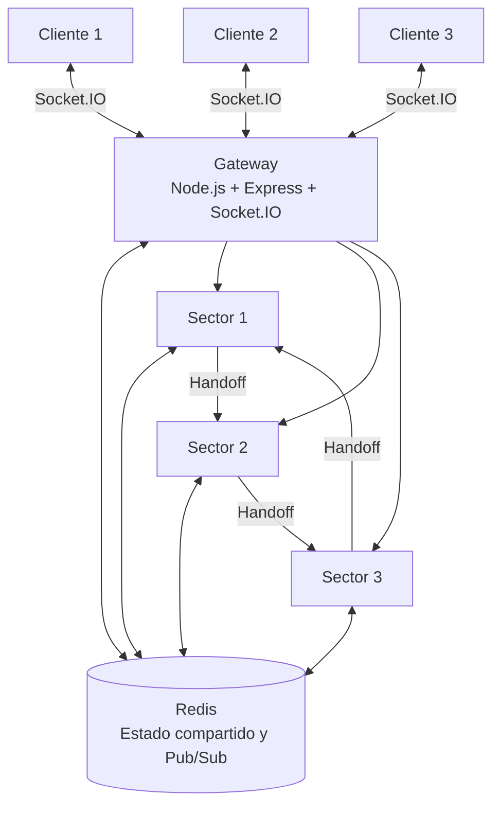
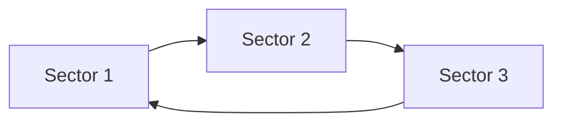

# RaceSync F1

RaceSync F1 es un sistema distribuido multijugador inspirado en una carrera de Fórmula 1. El proyecto fue desarrollado como parte de un proyecto integrador académico de la Carrera de Software de la Pontificia Universidad Católica del Ecuador - Sede Manabí.

La aplicación permite que varios jugadores participen en una carrera en tiempo real mientras el procesamiento se distribuye entre un Gateway, Redis y tres nodos de sector independientes. El sistema incorpora comunicación en tiempo real, sincronización lógica, transferencia de vehículos entre nodos, monitoreo de disponibilidad, elección de líder, control de rondas, bots y pruebas automatizadas.

## Aplicación desplegada

Versión pública:

https://race-f1-production.up.railway.app/

Repositorio principal:

https://github.com/Fabricioanchundia/Race-F1.git

## Objetivo

Desarrollar un sistema distribuido interactivo que permita aplicar y demostrar conceptos de:

- comunicación en tiempo real;
- concurrencia entre múltiples clientes;
- sincronización lógica;
- distribución del procesamiento;
- coordinación entre nodos;
- tolerancia a fallos;
- elección dinámica de líder;
- integración continua;
- análisis de calidad de código;
- pruebas funcionales automatizadas;
- despliegue en la nube.

## Características principales

RaceSync F1 incorpora actualmente:

- interfaz web 3D desarrollada con Babylon.js;
- selección de circuito y piloto;
- múltiples jugadores conectados simultáneamente;
- bots controlados por el servidor;
- grilla de salida sincronizada;
- secuencia de luces de inicio;
- procesamiento distribuido entre tres sectores;
- handoff de vehículos entre sectores;
- clasificación basada en vuelta y progreso de carrera;
- control de vueltas y finalización de carrera;
- gestión de jugadores que ingresan durante una ronda en curso;
- control de colisiones;
- sincronización del circuito entre participantes;
- suavizado visual del movimiento de vehículos remotos;
- reloj vectorial;
- heartbeats;
- algoritmo Bully para elección de líder;
- Redis Pub/Sub;
- pruebas funcionales y distribuidas con Selenium;
- análisis estático con SonarQube;
- integración continua con Jenkins;
- ejecución mediante Docker y Docker Compose;
- despliegue público en Railway.

## Arquitectura general



## Flujo general del sistema

1. El usuario accede a RaceSync F1 desde el navegador.
2. Selecciona un circuito y un piloto.
3. El cliente establece una conexión con el Gateway mediante Socket.IO.
4. El Gateway registra al jugador y coordina su incorporación al sistema.
5. El jugador es ubicado en la grilla de salida.
6. Los participantes esperan la secuencia sincronizada de luces.
7. La carrera comienza y los vehículos son procesados por los nodos de sector.
8. Redis distribuye estado y eventos entre los diferentes componentes.
9. Al alcanzar el límite de un sector, el vehículo es transferido al siguiente mediante un handoff.
10. El sistema mantiene el progreso, la vuelta, la clasificación y los eventos de carrera.
11. Al completar la carrera se presentan los resultados y se prepara la siguiente ronda.

## Componentes del sistema

### Gateway

Ubicación:

```text
gateway/
```

El Gateway constituye el punto de entrada para los clientes.

Responsabilidades principales:

- servir la interfaz web;
- administrar conexiones Socket.IO;
- registrar jugadores;
- recibir comandos de conducción;
- mantener información de clientes conectados;
- gestionar el reloj vectorial;
- comunicarse con los nodos de sector;
- publicar y recibir eventos mediante Redis;
- notificar cambios de sector;
- exponer el endpoint `/health`.

Puerto local:

```text
3000
```

Endpoint de verificación:

```text
GET /health
```

### Nodos de sector

Ubicación:

```text
sector-node/
```

La misma base de código permite ejecutar tres instancias independientes:

```text
Sector 1 -> puerto 3001
Sector 2 -> puerto 3002
Sector 3 -> puerto 3003
```

Cada nodo administra una parte determinada del progreso de la carrera.

Distribución conceptual:

```text
Sector 1 -> 0 a 33
Sector 2 -> 33 a 66
Sector 3 -> 66 a 100
```

Responsabilidades:

- administrar vehículos activos;
- actualizar posición, velocidad y carril;
- procesar colisiones;
- publicar el estado del sector;
- recibir vehículos;
- transferir vehículos;
- generar heartbeats;
- detectar fallos;
- participar en la elección de líder;
- coordinar eventos de carrera mediante Redis.

## Handoff entre sectores

Cuando un vehículo alcanza el límite de un sector se realiza una transferencia al siguiente nodo:



Durante el handoff se mantiene la información necesaria del vehículo para continuar la carrera, incluyendo su identificador, posición, velocidad, carril y estado asociado.

## Redis

Redis funciona como componente de coordinación y estado compartido del sistema distribuido.

Se utiliza para:

- publicación de estados de carrera;
- publicación de eventos;
- almacenamiento temporal del estado de vehículos;
- heartbeats de los sectores;
- coordinación entre procesos;
- notificaciones relacionadas con fallos;
- sincronización de determinados eventos entre nodos;
- limpieza coordinada de estado entre rondas.

La arquitectura utiliza Redis Pub/Sub para distribuir información entre los componentes sin acoplar directamente todos los procesos entre sí.

## Sincronización lógica

El Gateway utiliza un reloj vectorial para representar el orden lógico de eventos.

El reloj se actualiza durante operaciones relevantes del sistema y permite observar la evolución lógica de la comunicación distribuida sin depender exclusivamente de un reloj físico.

El valor del reloj vectorial también puede visualizarse desde la interfaz del juego.

## Heartbeats

Los sectores publican periódicamente información de disponibilidad en Redis mediante claves como:

```text
hb:sector:1
hb:sector:2
hb:sector:3
```

Este mecanismo permite detectar la ausencia de un nodo y generar los eventos correspondientes dentro de la arquitectura distribuida.

## Elección de líder

RaceSync F1 implementa el algoritmo Bully como mecanismo de elección de coordinador.

Ante determinadas condiciones de fallo, los nodos pueden iniciar un proceso de elección. Los nodos con identificadores superiores participan en la selección y el ganador comunica su condición de líder al resto de nodos activos.

## Gestión de carrera

### Grilla de salida

Los vehículos son ubicados en una grilla compacta próxima a la línea de salida y distribuidos entre diferentes carriles para evitar superposiciones iniciales.

### Secuencia de inicio

La carrera utiliza una secuencia de luces sincronizada. Los bots permanecen detenidos durante el proceso de salida y comienzan a moverse al finalizar la secuencia.

### Bots

El sistema incorpora pilotos controlados por el servidor. Estos vehículos participan en la carrera con velocidades objetivo y comportamiento automático.

### Colisiones

Los sectores detectan proximidad entre vehículos y aplican separación lateral, reducción de velocidad y periodos de recuperación para evitar que dos vehículos permanezcan bloqueados indefinidamente.

### Rondas y sala de espera

Si un jugador intenta ingresar mientras una carrera ya se encuentra en ejecución, el sistema puede mantenerlo en espera hasta la siguiente ronda.

Al comenzar una nueva ronda se coordinan el reinicio de bots y la limpieza de estados distribuidos entre los sectores mediante Redis.

### Clasificación

La clasificación considera el progreso global de carrera y la vuelta actual para mantener un orden coherente incluso cuando los vehículos realizan handoffs entre S1, S2 y S3.

## Tecnologías utilizadas

### Frontend

- HTML5
- CSS3
- JavaScript
- Babylon.js
- Socket.IO Client

### Backend

- Node.js 20
- Express
- Socket.IO
- Axios
- ioredis
- CORS
- UUID

### Infraestructura y distribución

- Redis 7
- Docker
- Docker Compose
- Railway

### Verificación y validación

- Selenium 4.46.0
- Python 3.12
- Google Chrome / Selenium WebDriver
- SonarQube Community
- Jenkins

### Control de versiones

- Git
- GitHub

## Estructura principal del repositorio

```text
Race-F1/
|
|-- client/
|
|-- gateway/
|   |-- public/
|   |-- src/
|   |   |-- index.js
|   |   `-- vectorClock.js
|   |-- Dockerfile
|   |-- package.json
|   `-- package-lock.json
|
|-- sector-node/
|   |-- src/
|   |   |-- index.js
|   |   |-- heartbeat.js
|   |   `-- bully.js
|   |-- Dockerfile
|   |-- package.json
|   `-- package-lock.json
|
|-- selenium_tests/
|   |-- test_racesync.py
|   |-- test_distribuido.py
|   `-- evidencias/
|
|-- docker-compose.yml
|-- sonar-project.properties
|-- requirements-selenium.txt
|-- Jenkinsfile
`-- README.md
```

El frontend servido por el Gateway se encuentra en:

```text
gateway/public/
```

## Ejecución local

### Requisitos

Se requiere tener instalados:

- Git
- Docker Desktop
- Docker Compose

Verificación:

```bash
git --version
docker --version
docker compose version
```

### Clonar el repositorio

```bash
git clone https://github.com/Fabricioanchundia/Race-F1.git
cd Race-F1
```

### Construir y levantar RaceSync F1

```bash
docker compose up -d --build redis gateway sector1 sector2 sector3
```

### Verificar los servicios

```bash
docker compose ps
```

Los servicios principales deben aparecer activos:

```text
redis
gateway
sector1
sector2
sector3
```

### Acceder a la aplicación

Abrir:

```text
http://localhost:3000
```

### Verificar el Gateway

En PowerShell:

```powershell
Invoke-RestMethod http://localhost:3000/health
```

En una terminal compatible con curl:

```bash
curl http://localhost:3000/health
```

El endpoint devuelve información relacionada con el estado del Gateway, jugadores conectados y reloj vectorial.

## Docker Compose

El archivo `docker-compose.yml` define el entorno local del proyecto.

Servicios principales:

```text
redis
gateway
sector1
sector2
sector3
```

También incluye servicios utilizados durante las actividades de Verificación y Validación:

```text
jenkins
sonarqube
```

Puertos definidos actualmente en `docker-compose.yml`:

```text
Gateway     -> 3000
Redis       -> 6379
Jenkins     -> 8090
SonarQube   -> 9000
```

## Despliegue en Railway

RaceSync F1 se encuentra desplegado en Railway.

Acceso público:

https://race-f1-production.up.railway.app/

La aplicación mantiene en producción la separación lógica de sus componentes principales:

```text
Cliente
   |
   v
Gateway
   |
   +------ Redis
   |
   +------ Sector 1
   +------ Sector 2
   +------ Sector 3
```

El Gateway es el punto de acceso público utilizado por los clientes, mientras los componentes distribuidos trabajan conjuntamente para procesar la carrera.

## Pruebas automatizadas con Selenium

Las pruebas se encuentran en:

```text
selenium_tests/
```

### Preparar el entorno

En Windows PowerShell:

```powershell
python -m venv .venv-selenium
.\.venv-selenium\Scripts\Activate.ps1
pip install -r requirements-selenium.txt
```

### Ejecutar pruebas funcionales

```powershell
python -m unittest .\selenium_tests\test_racesync.py -v
```

Los casos funcionales validan aspectos como:

- carga inicial de RaceSync F1;
- selección de circuito;
- selección de piloto;
- registro de jugador;
- visualización del HUD;
- presencia de S1, S2 y S3;
- presencia del reloj vectorial.

Las evidencias se almacenan en:

```text
selenium_tests/evidencias/
```

### Ejecutar prueba distribuida

```powershell
python -m unittest .\selenium_tests\test_distribuido.py -v
```

La prueba distribuida permite validar múltiples clientes, disponibilidad del Gateway y elementos propios de la arquitectura distribuida.

## Análisis de calidad con SonarQube

El repositorio utiliza:

```text
sonar-project.properties
```

La configuración actual analiza:

```text
client
gateway
sector-node
```

La copia de frontend ubicada en `client/public/` se excluye del análisis para evitar analizar dos veces el frontend servido realmente por el Gateway.

También se excluyen dependencias y artefactos como:

```text
node_modules
.git
coverage
.scannerwork
dist
build
*.min.js
```

SonarQube se utiliza para evaluar:

- bugs;
- vulnerabilidades;
- code smells;
- complejidad;
- duplicación;
- Security Hotspots;
- cobertura cuando existe un reporte compatible.

## Integración continua con Jenkins

Jenkins se utiliza para automatizar la validación técnica del repositorio.

Job:

```text
RaceSync-F1-VV
```

El Pipeline realiza:

1. limpieza del workspace;
2. obtención de la rama `main`;
3. identificación del commit analizado;
4. validación sintáctica de JavaScript;
5. validación de archivos `package.json`;
6. lectura de `sonar-project.properties` desde el repositorio;
7. ejecución de SonarScanner;
8. envío del análisis a SonarQube;
9. monitoreo automático del repositorio mediante SCM Polling.

Jenkins se ejecuta mediante Docker y el Pipeline Script utilizado para la práctica fue configurado dentro del job de Jenkins.

## Verificación realizada

Durante el desarrollo y las actividades de Verificación y Validación se comprobaron aspectos relacionados con:

- funcionamiento de la interfaz;
- selección de circuito y piloto;
- registro de jugadores;
- múltiples clientes simultáneos;
- reloj vectorial;
- disponibilidad del Gateway;
- heartbeats;
- caída controlada de nodos;
- elección de líder;
- recuperación de nodos;
- handoff entre sectores;
- comportamiento de colisiones;
- control de rondas;
- sincronización de salida;
- clasificación;
- latencia del Gateway;
- análisis estático con SonarQube;
- integración continua con Jenkins;
- automatización funcional mediante Selenium.

## Equipo

Proyecto desarrollado por estudiantes de la Carrera de Software de la Pontificia Universidad Católica del Ecuador - Sede Manabí.

Integrantes:

- John Steven Lopez Velez
- Alex Fabricio Anchundia Mero
- Daniel Farid Zambrano Macias

Periodo académico: 2026-01.

## Contexto académico

RaceSync F1 forma parte de un proyecto integrador orientado a la aplicación práctica de conceptos de:

- Sistemas Distribuidos;
- Desarrollo de Sistemas de Información;
- Verificación y Validación de Software.

El proyecto integra desarrollo web, comunicación distribuida, control de concurrencia, tolerancia a fallos, pruebas automatizadas, análisis de calidad e infraestructura de despliegue.
